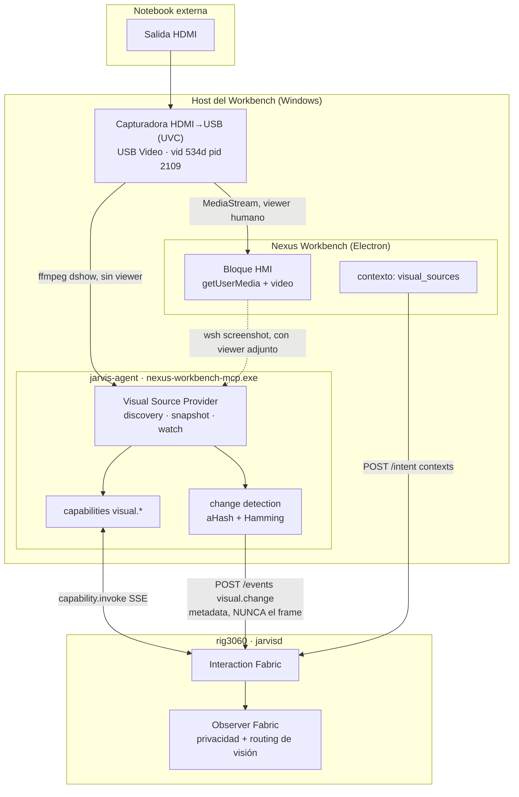
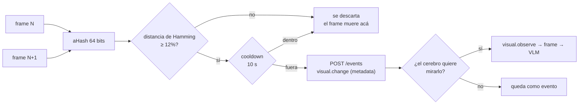

# Visual Sources — fuentes visuales del Workbench (HMI)

> Estado: implementado y validado contra hardware real (capturadora MS2109,
> `USB Video`, VID 534d / PID 2109) el 2026-08-24.
> Ver también: [ADR-0006 Detached Runtime](adr/ADR-0006-detached-runtime.md),
> [ADR-0004 NexusOS governance boundary](adr/ADR-0004-nexusos-governance-boundary.md).

## Qué es

Una **Visual Source** es una clase de objeto del Workbench, del mismo rango que
una terminal o un navegador: algo que se configura una vez, se muestra en un
bloque, se mueve entre monitores, persiste en el layout — y que además puede ser
**observado por Jarvis bajo gobernanza explícita**.

El caso que motivó la feature: una notebook externa que entrega su pantalla por
HDMI a una capturadora HDMI→USB conectada a la PC del Workbench. Pero nada en la
arquitectura sabe qué es un "banco": eso es una etiqueta configurable.

## La regla que ordena todo el diseño

**El Workbench es consumidor de la fuente, no su dueño.**

El provider —lo que sabe abrir el dispositivo y entregar un frame— vive en el
proceso del **jarvis-agent**, que corre en el host donde está el hardware y
sobrevive al cierre de la UI. El bloque HMI es un consumidor más; el cerebro es
otro.



## Flujo de datos

| Camino | Qué viaja | Cuándo |
|---|---|---|
| Capturadora → bloque HMI | MediaStream en vivo | mientras el bloque está abierto |
| Capturadora → provider | un frame JPEG efímero | sólo cuando alguien lo pide |
| Bloque → provider | un PNG del bloque | sólo si el bloque tiene el device tomado |
| Workbench → cerebro (`/intent`) | **metadata** de fuentes | en cada turno |
| Provider → cerebro (`/events`) | **metadata** del cambio | sólo con cambio significativo |
| Provider → cerebro (capability) | un frame base64 | sólo bajo `visual.snapshot`/`observe` |

`workbench.context` **nunca** lleva imagen. El contenido visual sale únicamente
por una capability explícita, que además queda auditada.

## El dispositivo es exclusivo (y eso ordena el arbitraje)

Verificado contra el hardware: dos consumidores simultáneos de la MS2109 no
existen. El segundo recibe de ffmpeg:

```
Could not run graph (sometimes caused by a device already in use by other application)
```

Por eso:

- **Sin viewer abierto** → el provider captura por `ffmpeg -f dshow`.
- **Con viewer abierto** → el frame lo entrega el bloque, vía `wsh screenshot`,
  que expone la captura de bloque que el motor ya implementaba
  (`CaptureBlockScreenshotCommand`, la misma que usa la tool de la AI).

El bloque publica `visual:viewer` y `visual:source` en su meta; el provider los
lee con `wsh blocks list --json` (cache de 1,5 s). No hay canal nuevo ni estado
compartido entre procesos.

Consecuencia conocida: con el viewer abierto, la imagen que ve la IA tiene la
resolución **del bloque en pantalla**, no los 1920x1080 de la fuente. Para leer
texto chico conviene maximizar el bloque, o cerrarlo y dejar que capture el
provider a resolución completa.

## Identidad del dispositivo

Windows reescribe el nombre amigable y la ruta PnP al reenchufar. La fuente
guarda varias claves y se resuelve de más específica a menos:

1. `hardwareid` — ruta PnP completa (`@device_pnp_\\?\usb#vid_534d&pid_2109...`)
2. `deviceid` — el id de `enumerateDevices()` (sólo del lado del renderer)
3. `vid` + `pid` — sobrevive al reenchufe y al cambio de puerto
4. `name` — **sólo si es inequívoco**; "USB Video" es el nombre de media docena
   de capturadoras distintas

**Si nada matchea, no se elige nada.** Abrir la webcam personal del usuario
porque la capturadora no aparece sería peor que mostrar `SOURCE OFFLINE`. Hay un
test que fija exactamente eso.

## Configuración

Vive en `settings.json` del Workbench, bajo `nexus:visualsources` — el mismo
mecanismo que `nexus:environments`. Se edita desde Settings (tiene schema) y
sobrevive a reinstalaciones.

```json
"nexus:visualsources": [
  {
    "id": "hdmi-primary",
    "type": "uvc",
    "label": "Banco",
    "device": { "name": "USB Video", "vid": "534d", "pid": "2109" },
    "audio": { "name": "Digital Audio Interface (USB Digital Audio)", "enabled": false },
    "aivision": "on_demand"
  }
]
```

| Campo | Significado |
|---|---|
| `id` | direccionable por las capabilities; sin id la fuente se ignora |
| `type` | `uvc` (implementado) · `desktop`/`window`/`remote`/`virtual` (declarados, sin provider) |
| `label` | sólo texto: es lo que el usuario nombra al hablar |
| `aivision` | `off` · `on_demand` (default) · `changes` |
| `width`/`height` | preferencia de captura; el dispositivo recorta a lo que soporta |

`continuous` existe como constante interna pero **no se acepta desde
configuración**: habilitarlo tiene que ser una decisión deliberada en código.

## Ver ≠ dejar mirar

Son dos permisos distintos y el sistema los trata como tales:

| | Human Viewer | AI Observer |
|---|---|---|
| Qué habilita | ver la señal en el bloque | que Jarvis obtenga un frame |
| Cómo se concede | abrir el bloque HMI | `aivision` de la fuente |
| Dónde se ve | el bloque | indicador "Yoshi Vision" en el bloque |
| Si está en `off` | la señal se ve igual | **ni se abre el dispositivo** |

Abrir el bloque **no** autoriza a la IA. Verificado end-to-end: con
`aivision: "off"`, `visual.observe` falla con
`ai_vision=off para esta fuente: el usuario no autorizó observación por IA`, y la
denegación queda auditada como `denied_ai_vision_off`.

## Capabilities

Se registran ante el cerebro junto a las de terminal, con su clase de riesgo. El
cerebro las proyecta a su registry de gobernanza como `client.workbench.<name>`,
así que pasan por el PEP y quedan en el audit trail (`audit_ref: pep-…`).

| Capability | Riesgo | Devuelve |
|---|---|---|
| `visual.sources.list` | `read` | metadata de las fuentes; **nunca** imagen |
| `visual.snapshot` | `read` | un frame de una fuente explícita |
| `visual.observe` | `read` | un frame + la intención declarada |
| `visual.watch` | `reversible-write` | arranca/para la vigilancia de cambios |

Ninguna acepta "la cámara por defecto": sin `source_id` explícito no hay captura.

## Observación eficiente

Jarvis no recibe 30 FPS. El pipeline barato corre en el agente:



Medido en el host real con la fuente estática: **4 frames capturados, 3
descartados, 0 eventos**. El modelo de visión no se tocó ni una vez.

El frame de línea de base no consume el cooldown: si lo hiciera, el primer
cambio real quedaría suprimido justo cuando el watch recién empieza a mirar.

Límites del watch: intervalo mínimo 1 s, TTL por defecto 30 min (máximo 4 h),
20 eventos máximo. Termina solo y avisa (`visual.watch.ended`) por TTL, por
tope de eventos o si la fuente se pierde. Un tick donde el viewer humano tiene
el device se saltea en silencio: no es una falla.

## Privacidad y manejo de datos

- **No se graba video.** Nunca. No hay código que lo haga.
- **No se persisten frames.** El snapshot va a un temporal que se borra siempre
  (`defer os.Remove`), y el CLI sin `-out` sólo devuelve metadata.
- Los eventos de cambio llevan hash y dimensiones, **no la imagen**.
- El análisis va por el Observer Fabric del cerebro, que ya tiene la política de
  privacidad (`local_only`, `never_persist`, clasificación de contenido
  sensible) y el routing de proveedores. **No se agregaron API keys.**
- Auditoría en las dos puntas: `nexus-mcp-audit.jsonl` del lado Workbench
  (con fuente, dimensiones, hash y tarea) y el audit del PEP del lado cerebro.
- El indicador de "Yoshi Vision" está siempre visible en el bloque.

## Deixis: cómo se resuelve "esto"

El Workbench publica en cada `/intent` un módulo `visual_sources` con id,
etiqueta, tipo, modo de observación, `visible` y `focused`; y si hay un bloque
HMI enfocado, además un módulo `visual` que lo señala.

El cerebro resuelve, en este orden:

1. **etiqueta nombrada** — "mirá la pantalla **del banco**"
2. **bloque HMI enfocado** — "mirá **esto**"
3. **única fuente visible** — "qué error aparece **ahí**"
4. **única fuente configurada** + la palabra "pantalla"

Ante ambigüedad (dos fuentes visibles sin foco, o dos etiquetas nombradas)
**devuelve None y cae al pipeline normal**: mirar la pantalla equivocada es peor
que no mirar. No hay un parser de frases: hay un vocabulario mínimo de verbos de
mirada y el resto lo aporta el contexto.

La capa visual se consulta **antes** que misiones en la cadena de `/intent`,
porque "mirá esto" con un HMI enfocado no es un handoff de misión. Sin fuente
resuelta, la cadena queda exactamente como estaba.

## Ciclo de vida

| Pieza | De quién depende hoy | Estado |
|---|---|---|
| Discovery de dispositivos | jarvis-agent | **desacoplado** de la UI |
| `visual.sources.list` | jarvis-agent | **desacoplado** |
| Snapshot sin viewer (ffmpeg) | jarvis-agent | **desacoplado** |
| Snapshot con viewer | bloque HMI renderizando | **acoplado** a la UI |
| Watch / change detection | jarvis-agent | **desacoplado** |
| Viewer en vivo | bloque HMI | acoplado por definición |

Con el Workbench cerrado, el agente sigue enumerando, capturando y vigilando: el
único camino que necesita la UI es el que existe *porque* la UI tiene el device.

### Migración futura a un servicio de background

Las interfaces ya están cortadas para que el provider se mude sin romper
contratos:

- `DeviceEnumerator` — interfaz, hoy implementada con ffmpeg
- `VisualSourceRegistry.SetViewerBridge(probe, capture)` — el arbitraje con el
  viewer es inyectado, no cableado
- `VisualEventSink` — la salida de eventos es una función inyectada
- Las capabilities son el contrato público; quién las sirve es un detalle

Mudar el provider a un servicio propio es reimplementar esas cuatro costuras y
mover el registro de capabilities. Ni el bloque ni el cerebro se enteran.

## Errores

| Código | Significado | Qué hace el bloque |
|---|---|---|
| `NO_DEVICE` | el dispositivo configurado no está | offline + Reconnect / Select Source |
| `DEVICE_REMOVED` | estaba y se desconectó | offline + reconexión con backoff |
| `DEVICE_BUSY` | otro proceso tiene la capturadora | lo informa; el snapshot va por el viewer |
| `PERMISSION_DENIED` | sin permiso de cámara | apunta a Configuración > Privacidad y permisos; **no** reintenta |
| `STREAM_FAILED` | fallo genérico de captura | offline + reintento |
| `UNSUPPORTED_FORMAT` | el device no soporta el formato | lo informa |
| `RECONNECTING` | transitorio | spinner |

El error queda **contenido en el bloque**. Que falle la capturadora nunca tumba
el Workbench.

## Requisitos de hardware y software

- Una capturadora **UVC** (clase estándar; las MS2109 andan sin driver).
- **ffmpeg** en el PATH del host del agente (probado con 8.0.1). Sin ffmpeg, el
  listado sigue funcionando pero reporta el fallo en la fuente; no rompe nada.
- Permiso de cámara del Workbench (se pide una vez y se guarda por origen).

## Troubleshooting

Todo se diagnostica sin abrir la app ni el cerebro:

```bash
# ¿el host ve la capturadora?
nexus-workbench-mcp visual devices

# ¿la config matchea con el hardware?
nexus-workbench-mcp visual list

# ¿entrega un frame? (sin -out no escribe nada, sólo metadata)
nexus-workbench-mcp visual snapshot -source hdmi-primary
nexus-workbench-mcp visual snapshot -source hdmi-primary -out frame.jpg
```

| Síntoma | Causa probable |
|---|---|
| `status: offline`, `NO_DEVICE` | la capturadora no está enchufada, o vid/pid no coincide con `visual devices` |
| `hay más de un dispositivo llamado X` | dos capturadoras del mismo modelo: agregar `vid`/`pid` o `hardwareid` |
| `DEVICE_BUSY` desde el CLI | el bloque HMI está abierto y tiene el device (es lo esperado) |
| frame negro con `status: available` | el dispositivo abre pero no hay señal HDMI entrando |
| `matched_by: name` | está resolviendo por nombre; agregar vid/pid para que sobreviva un reenchufe |
| el bloque pide permiso cada vez | el origen cambió (dev vs producción); revisar Privacidad y permisos |

## Limitaciones conocidas

1. **Snapshot con el viewer abierto sale a la resolución del bloque**, no a la de
   la fuente, y recorta el marco del bloque (header y barra de estado incluidos).
2. **Audio HDMI: detectado, no reproducido.** La capturadora expone su audio como
   un dispositivo aparte; en Windows dshow lo lista con la forma waveout
   (`@device_cm_…wave_{GUID}`), **sin vid/pid**, así que correlacionarlo con el
   video exige nombrarlo en `audio.name`. Está detectado y reportado
   (`audio_available`); reproducirlo queda fuera de este slice.
3. **Sólo `uvc` tiene provider.** Los otros tipos declaran su contrato y
   reportan honestamente que no está implementado.
4. **El watch necesita el agente vivo.** Si el agente se cae, los watches se
   pierden (no se persisten). Se avisa por `visual.watch.ended` sólo si el
   proceso termina ordenadamente.
5. **Un bloque HMI por fuente y por tab.** El botón enfoca el existente; el
   alcance de la deduplicación es el tab actual.
