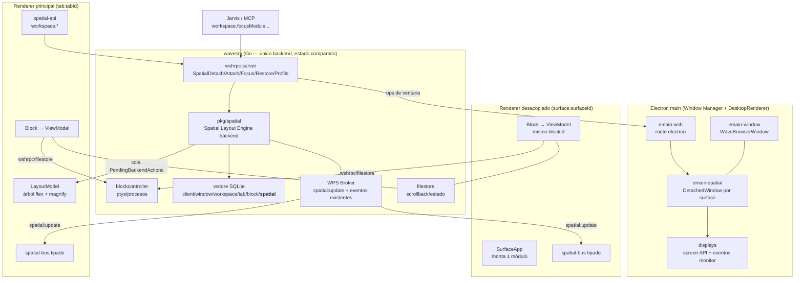

# Spatial Workspace — Documento de arquitectura

- Estado: Propuesta aceptada para MVP (ver ADR-0006)
- Fecha: 2026-07-30
- Relacionados: ADR-0001, ADR-0002, ADR-0004, ADR-0005, D-018, D-020

## 1. Principio arquitectónico

La unidad principal del Workbench es el **módulo**, no la ventana. Un módulo
(Terminal, Jarvis, CPU+Mem, File Explorer, Logs, Kubernetes, ...) existe de
forma independiente de la superficie donde se renderiza. Las ventanas son
solamente superficies visuales.

Este principio ya está parcialmente materializado en el motor Wave:

- El estado funcional de un módulo NO vive en el componente visual. La pty de
  un terminal es propiedad de `wavesrv` (`pkg/blockcontroller`), el scrollback
  se persiste en el filestore (archivo circular de 2 MiB por bloque), y el
  view model del frontend es desechable: al desmontar un bloque el shell sigue
  corriendo y al re-montar se restaura desde el backend
  (`frontend/app/view/term/termwrap.ts:382`).
- El "bloque" de Wave (`waveobj.Block`) es ya la entidad módulo: identidad
  estable (OID), tipo (`meta.view`), estado backend (meta + filestore +
  controller), y renderizado desacoplado (`BlockRegistry` →
  `makeViewModel`).

Lo que NO existe hoy y esta arquitectura agrega: la noción de **Surface**
(dónde se muestra un módulo), el **Spatial Layout Engine** (quién decide
posición/tamaño/monitor/foco a través de superficies), ventanas desacopladas,
multi-monitor gobernado y perfiles.

## 2. Hechos del motor actual que condicionan el diseño

Resultado del análisis completo del fork (2026-07-30):

| # | Hecho | Referencia |
|---|-------|------------|
| H1 | 1 renderer por **tab** (`WebContentsView`), no por ventana. El frontend es una app de tab único (`atoms.staticTabId` inmutable). | `emain/emain-tabview.ts:118`, `global-atoms.ts:79` |
| H2 | 1 ventana ⇄ 1 workspace (exclusivo). `SwitchWorkspace` rechaza duplicados. | `pkg/wcore/window.go:41` |
| H3 | La geometría de bloques vive en `LayoutState.RootNode` (árbol flex, propiedad del frontend); el backend solo encola `PendingBackendActions` que el renderer dueño drena con dedup por `actionid`. Funciona para tabs no cargados (la cola espera en DB). | `pkg/wcore/layout.go:81`, `layoutModel.ts:387` |
| H4 | No existe mover un bloque entre tabs/ventanas. `Tab.BlockIds` + `Block.ParentORef` son la propiedad; el transporte correcto es la cola de acciones (viaja solo `blockId`, nunca nodos). | análisis §6 layout |
| H5 | `cleanuporphaned` (Go y TS) borra cualquier bloque de `tab.blockids` que no esté en el árbol → un bloque desacoplado sería destruido si no se lo excluye. | `layoutModel.ts:411`, `pkg/service/blockservice` |
| H6 | Existe un patrón de ventana secundaria: Builder. `BrowserWindow` plano, mismo `index.html`, identidad por IPC (`builder-init`), `windowId` sintético sin `waveobj.Window`, estado en rtinfo. | `emain/emain-builder.ts:35` |
| H7 | Magnify ya implementa "Focus": presentacional (no toca `size` del árbol → restaurar es automático), persistido (`magnifiednodeid`), con backdrop que atenúa el resto. | `layoutModel.ts:798`, `layoutTree.ts:402` |
| H8 | El broker WPS es fan-out por scope; varios renderers pueden suscribirse al mismo `block:<id>`. Lo que debe ser único es el **route id** por renderer. | `pkg/wps/wps.go:226`, `pkg/web/ws.go:225` |
| H9 | El renderer no tiene hoy ninguna API de monitores; emain no escucha `display-added/removed/metrics-changed`; `scaleFactor` no participa del cálculo de bounds; toda ventana nueva cae en el monitor primario. `moveWindowToDisplay` existe pero solo lo usa quake. | `emain-util.ts:187`, `emain-window.ts:955` |
| H10 | Persistencia: SQLite, una tabla JSON por otype, migraciones golang-migrate embebidas (11 en wstore). Agregar un otype = 1 migración + `AllWaveObjTypes()` + tsgen. | `pkg/wstore/wstore_dbsetup.go`, `db/migrations-wstore/` |
| H11 | Electron tiene su propia ruta wshrpc (`electron`) con handlers (`handle_focuswindow`) → los comandos que necesitan window-management pueden viajar por RPC hasta emain. | `emain/emain-wsh.ts:46` |
| H12 | Jarvis es un singleton **por renderer** (`JarvisCore.getInstance()`); con múltiples ventanas su estado mock divergiría. El runtime real (OpenClaw/MCP) será backend-side y compartido. | `jarvis-core.ts:52`, ADR-0005 |

## 3. Las nueve capas y su mapeo

| Capa pedida | Componente | Estado |
|---|---|---|
| 1. Module Runtime | `pkg/blockcontroller` + `BlockRegistry`/view models | **Existe** (se reutiliza sin cambios) |
| 2. Module State | `waveobj.Block` (meta) + filestore + rtinfo | **Existe**; se agrega `ModuleInstance` como capa espacial sobre el bloque |
| 3. Workspace State | `waveobj.Workspace`/`Tab` | **Existe** |
| 4. Spatial Layout Engine | `pkg/spatial` (Go, nuevo) + `frontend/app/nexus/spatial/` (TS, nuevo) | **Nuevo** |
| 5. Desktop Renderer | emain (BaseWindow/BrowserWindow) detrás de la interfaz `WorkspaceRenderer` | **Existe + interfaz nueva** |
| 6. Window Manager | `emain/emain-window.ts` + `emain/emain-spatial.ts` (nuevo, patrón Builder) | **Existe + extensión** |
| 7. Persistence Layer | wstore: nuevo otype `spatial` (migración 000012) + perfiles en config dir | **Nuevo sobre mecanismo existente** |
| 8. Shared Context | wavesrv (conexiones, terminales, jobs, config) — único backend para todas las ventanas | **Existe** (las ventanas nuevas se conectan al mismo wavesrv) |
| 9. Event Bus | WPS (`spatial:update`) + `spatial-bus.ts` tipado en frontend (patrón jarvis-bus) | **Existe + eventos nuevos** |

## 4. Diagrama de componentes

Puntos clave del flujo:

- **Un solo backend.** Las ventanas desacopladas abren su propio websocket
  contra el mismo wavesrv con route `surface:<surfaceId>`. No se duplican
  procesos, ptys, sockets ni conexiones SSH (H8, H1).
- **El módulo no se duplica al moverse.** Pop Out solo cambia dónde se monta
  el mismo `blockId`: se quita la hoja del árbol del tab (acción `delete` de
  layout), se registra la instancia como detached en `SpatialState`, y la
  ventana nueva monta `<Block blockId>` directamente. La pty ni se entera.
- **El engine decide, los renderers obedecen.** Toda mutación espacial entra
  por RPC al engine (aunque la origine un menú contextual local), el engine
  persiste y publica `spatial:update`; los renderers reaccionan al evento.
  Sin polling.

## 5. Decisiones de diseño (resumen; detalle en ADR-0006)

1. **Surface ⇄ contexto de renderizado 1:1.** `MainWindowSurface` envuelve el
   layout del tab activo de una ventana Wave existente (encapsula el
   LayoutModel actual detrás de la interfaz, sin reescribirlo).
   `DetachedWindowSurface` es una `BrowserWindow` patrón Builder (H6) con
   init IPC propio (`spatial-init`) y route `surface:<id>`. `MonitorSurface`
   es una DetachedWindowSurface con bounds = workArea del monitor (variante,
   no un tipo runtime distinto). Los tipos `WebSurface/XRSurface/ARSurface/
   RemoteSurface` quedan reservados en el enum y el modelo de datos.
2. **El bloque desacoplado permanece en `Tab.BlockIds`.** Así conserva
   `ParentORef`, resolvers y ciclo de vida. Se excluye de `cleanuporphaned`
   consultando `SpatialState` (2 inserciones mínimas en árbol Wave, H5).
3. **Focus = magnify para módulos acoplados; ventana al frente + bounds
   snapshot para desacoplados.** Se guarda un `FocusSnapshot` antes de
   enfocar; Return lo restaura. Nunca se destruye/recrea el módulo (H7).
4. **Persistencia versionada:** nuevo otype `spatial` (uno por workspace) con
   `schemaversion` interno + migración SQL 000012. Perfiles como archivos
   JSON en el config dir (`nexus-profiles/`), sin secretos: solo IDs,
   geometría y metadatos de vista.
5. **Multi-monitor gobernado desde emain:** listeners de
   `display-added/removed/metrics-changed`, catálogo de monitores expuesto
   por RPC, reconciliación al arrancar y al desconectar un monitor (módulos
   huérfanos → monitor primario, mapping original preservado en
   `SpatialState.MonitorMemory` para restaurar si el monitor vuelve).
   Los bounds se manejan en coordenadas DIP de Electron (que ya absorben
   parte del escalado); `scaleFactor` se guarda por surface para decisiones
   de restauración, no para aritmética de píxeles.
6. **Event bus:** un evento WPS `spatial:update` cuyo payload discrimina el
   tipo (`module.detached`, `surface.created`, `monitor.disconnected`, ...).
   En frontend, `spatial-bus.ts` (patrón `jarvis-bus`) lo re-expone tipado.
   Motivo: WPS exige 3 ediciones por evento nuevo en árbol Wave; un solo
   evento sobre + bus tipado local mantiene el diff mínimo (ADR-0001) sin
   sacrificar tipado donde se consume.
7. **API de comandos reutilizable por Jarvis:** RPCs `Spatial*Command` en
   wshrpc + fachada TS `workspace.*`. El MCP (`nexus/mcp`) podrá invocarlas
   vía `wsh` sin tocar el engine, igual que hace hoy con `createblock`.
8. **Jarvis en múltiples ventanas:** limitación aceptada del MVP — el
   `JarvisCore` mock es por renderer (H12). No se corrige ahora porque el
   runtime real será backend-side; queda en riesgos y backlog.

## 6. Qué se reutiliza y qué se agrega

**Se reutiliza sin cambios:** blockcontroller y todo el runtime de módulos,
filestore, WPS broker, wshrpc router, LayoutModel/árbol flex para el interior
de la ventana principal, magnify, `PendingBackendActions`, patrón Builder,
`moveWindowToDisplay`, migraciones golang-migrate, mecánica de widgets.

**Se agrega (fork-owned):** `pkg/spatial` (Go), `frontend/app/nexus/spatial/`
(TS), `emain/emain-spatial.ts` + `emain/emain-displays.ts` (Electron),
migración `000012_spatial`, RPCs `Spatial*`, evento WPS `spatial:update`,
menú contextual de bloque (ítems espaciales), perfiles.

**Se toca mínimamente en árbol Wave:** registro del otype, tabla de eventos
WPS, guard de detached en los dos `cleanuporphaned`, hook del menú contextual
del block frame, hook de arranque en emain, entries IPC/preload para
monitores. Cada inserción con marcador `// nexus:` para upstream-sync
(ADR-0003).

## 7. Acoplamientos detectados que había que romper (y cómo)

| Acoplamiento | Ruptura |
|---|---|
| Renderer asume ser un tab (`staticTabId`, route `tab:<id>`) | La ventana desacoplada NO es un tab: bootstrap propio `initSurface()` con route `surface:<id>`; monta `<Block>` con un `BlockNodeModel` sintético (la interfaz `blocktypes.ts:7` es estrecha: blockId, isFocused, isMagnified, onClose, focusNode, toggleMagnify — todo implementable sin LayoutModel) |
| `cleanuporphaned` destruye bloques fuera del árbol | Exclusión por `SpatialState.DetachedModules` en Go y TS |
| Geometría solo en árbol flex del tab | `SpatialPlacement` en `ModuleInstance` es autoritativo solo cuando `isDetached`; acoplado, la autoridad sigue siendo el árbol (sin duplicar fuente de verdad) |
| Ventanas nuevas caen siempre en monitor primario | `createSurface` acepta `monitorId` + bounds y valida contra `screen.getAllDisplays()` |
| Nada escucha cambios de monitores | `emain-displays.ts` publica `monitor.connected/disconnected` y dispara reconciliación |

## 8. Preparación para XR sin implementarla

- `Surface.rendererType` (`"desktop"` hoy; `"web" | "xr" | "ar" | "remote"`
  reservados) y `Surface.type` como string constants extensibles.
- `SpatialPlacement` con campos opcionales `z, rotation, depth, anchor,
  spatialScale` ya presentes en el tipo (no usados por DesktopRenderer).
- La interfaz `WorkspaceRenderer` (contratos §CONTRACTS.md) es lo único que
  un XRRenderer futuro debe implementar; el engine, la persistencia, el bus
  y la API Jarvis no conocen Electron.
- Regla de oro sostenida en todo el diseño: **el engine nunca importa
  Electron ni React**; emain y los renderers son plugins de salida.
